# Enhanced Plan: PromptPal Development

This plan detailes the 5-phase development cycle for PromptPal, targeting a January 31st launch.

## 📊 Current Status: Phase 1 Complete ✅

**Completed:** January 3, 2026
- ✅ Full Phase 1 implementation with working Expo app
- ✅ App runs successfully in Expo Go without errors
- ✅ Core architecture established and tested
- ✅ All major dependency issues resolved

**Ready for Development:**
- 🎮 Functional level select and game screens
- 🎨 Dark theme UI with consistent design system
- 🔄 State management with persistence
- 🧭 Working navigation and routing
- 📱 Mobile-responsive layouts

**Key Achievements:**
- Resolved 4 major dependency conflicts
- Fixed 3 runtime errors including routing issues
- Implemented robust error handling for production readiness
- Established scalable architecture for Phase 2+ features

## ✅ Phase 1: Project Initialization & Architecture - COMPLETED

Objective: Establish the codebase foundation, navigation structure, and styling system.

### ✅ 1. Environment Setup - COMPLETED

- ✅ Initialize Expo project using the "Blank (TypeScript)" template.
- ✅ Install core dependencies: `nativewind`, `tailwindcss`, `expo-router`, `zustand`, `expo-haptics`, `expo-secure-store`.
- ✅ Install additional required dependencies: `react-native-safe-area-context`, `expo-linking`, `react-native-screens`.
- ✅ Configure `tailwind.config.js` with a custom dark mode palette:
    - Background: `#121212`, Surface: `#1E1E1E`, Accent: `#BB86FC`.

### ✅ 2. Directory Structure Implementation - COMPLETED

- ✅ `src/components/ui`: Atomic reusable components (Button, Input, Modal).
- ✅ `src/features/game`: Game state management with Zustand store and persistence.
- ✅ `src/features/levels`: Level data and game content structure.
- ✅ `src/lib`: API services and helper functions (Gemini service placeholder).
- ✅ `src/app`: File-based routing system with Expo Router.

### ✅ 3. Navigation Skeleton - COMPLETED

- ✅ `_layout.tsx`: Global layout with StatusBar configuration.
- ✅ `index.tsx`: Functional Level Select screen with grid layout and unlock system.
- ✅ `game/[id].tsx`: Dynamic route for gameplay with split-screen layout.

### ✅ 4. Core Infrastructure - COMPLETED

- ✅ Zustand state management with SecureStore persistence.
- ✅ Basic Gemini API service with placeholder functions.
- ✅ Sample level data structure with difficulty tiers.
- ✅ UI component library with consistent styling.
- ✅ Error handling and robust store rehydration.

### ✅ 5. Bug Fixes & Optimization - COMPLETED

- ✅ Fixed JSX syntax error (renamed `index.ts` to `index.tsx`).
- ✅ Resolved missing dependency errors (`react-native-safe-area-context`, `expo-linking`, `react-native-screens`).
- ✅ Fixed "Cannot read property 'keys' of undefined" error in routing.
- ✅ Corrected `useState` vs `useEffect` usage in game screen.
- ✅ Implemented proper error handling in storage adapters.

## 🚀 Phase 2: Core Service Layer - READY TO START

**Objective:** Implement AI logic for image generation, scoring, and local assistance.

**Estimated Time:** 8-12 hours

**Prerequisites:**
- Phase 1 must be complete and app running in Expo Go
- Google Cloud account with billing enabled
- Basic understanding of async/await in TypeScript
- Familiarity with REST APIs and environment variables

---

### Step 2.1: Google Cloud Setup & API Keys

**Goal:** Obtain API credentials for Gemini AI services.

#### 2.1.1 Create Google Cloud Project

1. Navigate to [Google Cloud Console](https://console.cloud.google.com/)
2. Click "Select a project" → "New Project"
3. Name it `promptpal-production`
4. Click "Create" and wait for project creation (30-60 seconds)
5. Ensure the new project is selected in the top navigation bar

#### 2.1.2 Enable Required APIs

1. In the left sidebar, go to **APIs & Services** → **Library**
2. Search for and enable the following APIs (click each, then click "Enable"):
   - **Generative Language API** (for Gemini text/vision models)
   - **Vertex AI API** (for image generation with Imagen)
3. Wait for each API to finish enabling (green checkmark appears)

#### 2.1.3 Create API Key

1. Go to **APIs & Services** → **Credentials**
2. Click **+ CREATE CREDENTIALS** → **API Key**
3. Copy the generated key immediately (you'll only see it once)
4. Click **Edit API key** (pencil icon)
5. Under **API restrictions**, select "Restrict key"
6. Check only:
   - Generative Language API
   - Vertex AI API
7. Click **Save**

#### 2.1.4 Store API Key Securely

1. In your project root, create a `.env` file:
   ```bash
   touch .env
   ```

2. Add your API key:
   ```env
   EXPO_PUBLIC_GEMINI_API_KEY=your_api_key_here
   ```

3. Verify `.env` is in `.gitignore`:
   ```bash
   grep -q "^\.env$" .gitignore || echo ".env" >> .gitignore
   ```

> [!WARNING]
> Never commit `.env` to version control. The `EXPO_PUBLIC_` prefix makes this variable accessible in client code—acceptable for a prototype, but use a backend proxy for production.

---

### Step 2.2: Image Generation Service

**Goal:** Create a service that generates images from text prompts using Gemini.

#### 2.2.1 Install HTTP Client

```bash
npm install axios
```

#### 2.2.2 Create Type Definitions

Create `src/types/gemini.ts`:

```typescript
export interface GenerateImageRequest {
  prompt: string;
  aspectRatio?: '1:1' | '16:9' | '9:16';
  numberOfImages?: number;
}

export interface GenerateImageResponse {
  imageUrl: string;
  revisedPrompt?: string; // AI may modify prompt for safety
  cached: boolean;
}

export interface GeminiError {
  code: string;
  message: string;
  status: number;
}
```

**Why?** TypeScript interfaces ensure type safety and make the API contract explicit.

#### 2.2.3 Implement Image Generation Service

Create `src/lib/gemini.ts`:

```typescript
import axios from 'axios';
import { GenerateImageRequest, GenerateImageResponse, GeminiError } from '@/types/gemini';

const API_KEY = process.env.EXPO_PUBLIC_GEMINI_API_KEY;
const GEMINI_ENDPOINT = 'https://generativelanguage.googleapis.com/v1beta';

// In-memory cache to prevent redundant API calls
const imageCache = new Map<string, string>();

/**
 * Generates an image from a text prompt using Gemini Imagen.
 * Implements caching to reduce API costs and latency.
 */
export async function generateImage(
  request: GenerateImageRequest
): Promise<GenerateImageResponse> {
  // Step 1: Validate API key
  if (!API_KEY) {
    throw new Error('EXPO_PUBLIC_GEMINI_API_KEY is not set in .env');
  }

  // Step 2: Check cache
  const cacheKey = `${request.prompt}-${request.aspectRatio || '1:1'}`;
  if (imageCache.has(cacheKey)) {
    console.log('[Gemini] Cache hit for prompt:', request.prompt.substring(0, 50));
    return {
      imageUrl: imageCache.get(cacheKey)!,
      cached: true,
    };
  }

  // Step 3: Make API request
  try {
    console.log('[Gemini] Generating image for prompt:', request.prompt.substring(0, 50));
    
    const response = await axios.post(
      `${GEMINI_ENDPOINT}/models/imagen-3.0-generate-001:predict`,
      {
        instances: [
          {
            prompt: request.prompt,
          },
        ],
        parameters: {
          sampleCount: request.numberOfImages || 1,
          aspectRatio: request.aspectRatio || '1:1',
        },
      },
      {
        headers: {
          'Content-Type': 'application/json',
          'x-goog-api-key': API_KEY,
        },
        timeout: 30000, // 30 second timeout
      }
    );

    // Step 4: Extract image URL from response
    const imageUrl = response.data.predictions[0].bytesBase64Encoded
      ? `data:image/png;base64,${response.data.predictions[0].bytesBase64Encoded}`
      : response.data.predictions[0].mimeType;

    // Step 5: Cache result
    imageCache.set(cacheKey, imageUrl);

    return {
      imageUrl,
      revisedPrompt: response.data.predictions[0].safetyAttributes?.revisedPrompt,
      cached: false,
    };
  } catch (error) {
    // Step 6: Handle errors
    if (axios.isAxiosError(error)) {
      const geminiError: GeminiError = {
        code: error.response?.data?.error?.code || 'UNKNOWN',
        message: error.response?.data?.error?.message || error.message,
        status: error.response?.status || 500,
      };
      
      console.error('[Gemini] API Error:', geminiError);
      throw new Error(`Image generation failed: ${geminiError.message}`);
    }
    
    throw error;
  }
}

/**
 * Clears the image cache. Useful for testing or memory management.
 */
export function clearImageCache(): void {
  imageCache.clear();
  console.log('[Gemini] Cache cleared');
}
```

#### 2.2.4 Test the Service

Create `src/lib/__tests__/gemini.test.ts`:

```typescript
import { generateImage, clearImageCache } from '../gemini';

describe('generateImage', () => {
  beforeEach(() => {
    clearImageCache();
  });

  it('should generate an image from a prompt', async () => {
    const result = await generateImage({
      prompt: 'A serene mountain landscape at sunset',
    });

    expect(result.imageUrl).toBeTruthy();
    expect(result.cached).toBe(false);
  }, 35000); // Increase timeout for API call

  it('should return cached result on second call', async () => {
    const prompt = 'A futuristic city skyline';
    
    const first = await generateImage({ prompt });
    const second = await generateImage({ prompt });

    expect(second.cached).toBe(true);
    expect(second.imageUrl).toBe(first.imageUrl);
  }, 35000);
});
```

**Run tests:**
```bash
npm test -- gemini.test.ts
```

> [!TIP]
> If tests fail with "API key not set", ensure your `.env` file is in the project root and restart the Metro bundler.

---

### Step 2.3: Scoring Logic

**Goal:** Compare two images using Gemini Vision to calculate similarity.

#### 2.3.1 Create Scoring Service

Create `src/lib/scoring.ts`:

```typescript
import axios from 'axios';

const API_KEY = process.env.EXPO_PUBLIC_GEMINI_API_KEY;
const GEMINI_VISION_ENDPOINT = 'https://generativelanguage.googleapis.com/v1beta/models/gemini-1.5-flash:generateContent';

export interface ComparisonResult {
  score: number; // 0-100
  feedback: string; // AI-generated explanation
  matchedElements: string[]; // e.g., ["color palette", "composition"]
}

/**
 * Compares two images using Gemini Vision.
 * @param targetImageUrl - Base64 or URL of the target image
 * @param userImageUrl - Base64 or URL of the user's generated image
 * @returns Similarity score (0-100) and detailed feedback
 */
export async function compareImages(
  targetImageUrl: string,
  userImageUrl: string
): Promise<ComparisonResult> {
  if (!API_KEY) {
    throw new Error('EXPO_PUBLIC_GEMINI_API_KEY is not set');
  }

  try {
    // Step 1: Convert images to base64 if they're URLs
    const targetBase64 = await imageToBase64(targetImageUrl);
    const userBase64 = await imageToBase64(userImageUrl);

    // Step 2: Construct prompt for Gemini Vision
    const prompt = `You are an expert image comparison AI. Compare these two images and provide:
1. A similarity score from 0-100 (where 100 is identical)
2. A brief explanation of similarities and differences
3. List of matched visual elements (e.g., "color palette", "subject matter", "lighting")

Respond in JSON format:
{
  "score": <number>,
  "feedback": "<string>",
  "matchedElements": ["<element1>", "<element2>"]
}`;

    // Step 3: Make API request
    const response = await axios.post(
      GEMINI_VISION_ENDPOINT,
      {
        contents: [
          {
            parts: [
              { text: prompt },
              {
                inline_data: {
                  mime_type: 'image/png',
                  data: targetBase64,
                },
              },
              {
                inline_data: {
                  mime_type: 'image/png',
                  data: userBase64,
                },
              },
            ],
          },
        ],
      },
      {
        headers: {
          'Content-Type': 'application/json',
          'x-goog-api-key': API_KEY,
        },
        timeout: 30000,
      }
    );

    // Step 4: Parse JSON response
    const textResponse = response.data.candidates[0].content.parts[0].text;
    const jsonMatch = textResponse.match(/\{[\s\S]*\}/);
    
    if (!jsonMatch) {
      throw new Error('Failed to parse JSON from Gemini response');
    }

    const result: ComparisonResult = JSON.parse(jsonMatch[0]);
    
    // Step 5: Validate score range
    result.score = Math.max(0, Math.min(100, result.score));

    return result;
  } catch (error) {
    console.error('[Scoring] Error comparing images:', error);
    throw new Error('Image comparison failed. Please try again.');
  }
}

/**
 * Converts an image URL or data URI to base64 string
 */
async function imageToBase64(imageUrl: string): Promise<string> {
  // If already base64, extract the data
  if (imageUrl.startsWith('data:image')) {
    return imageUrl.split(',')[1];
  }

  // Otherwise, fetch and convert
  const response = await axios.get(imageUrl, { responseType: 'arraybuffer' });
  const base64 = Buffer.from(response.data, 'binary').toString('base64');
  return base64;
}
```

#### 2.3.2 Test Scoring Service

Create `src/lib/__tests__/scoring.test.ts`:

```typescript
import { compareImages } from '../scoring';

describe('compareImages', () => {
  it('should return high score for identical images', async () => {
    // Use a sample image (you'll need to host this or use a base64 string)
    const sampleImage = 'https://via.placeholder.com/300/FF5733/FFFFFF?text=Test';
    
    const result = await compareImages(sampleImage, sampleImage);

    expect(result.score).toBeGreaterThan(90);
    expect(result.feedback).toBeTruthy();
    expect(Array.isArray(result.matchedElements)).toBe(true);
  }, 35000);

  it('should return low score for different images', async () => {
    const image1 = 'https://via.placeholder.com/300/FF5733/FFFFFF?text=Red';
    const image2 = 'https://via.placeholder.com/300/3357FF/FFFFFF?text=Blue';
    
    const result = await compareImages(image1, image2);

    expect(result.score).toBeLessThan(50);
  }, 35000);
});
```

---

### Step 2.4: "Nano Banana" Implementation

**Goal:** Implement local AI assistance using Android AICore (Gemini Nano) with fallback to cloud API.

> [!IMPORTANT]
> This feature only works on Android devices with AICore support (Pixel 8+, Samsung S24+). iOS and older Android devices will automatically use the cloud fallback.

#### 2.4.1 Create Native Module (Android Only)

**Step 1:** Create the Kotlin module directory:
```bash
mkdir -p android/app/src/main/java/com/promptpal/aicore
```

**Step 2:** Create `AICoreModule.kt`:

Create `android/app/src/main/java/com/promptpal/aicore/AICoreModule.kt`:

```kotlin
package com.promptpal.aicore

import com.facebook.react.bridge.ReactApplicationContext
import com.facebook.react.bridge.ReactContextBaseJavaModule
import com.facebook.react.bridge.ReactMethod
import com.facebook.react.bridge.Promise
import com.google.android.gms.aicore.AiCoreClient
import com.google.android.gms.aicore.GenerativeModel
import kotlinx.coroutines.CoroutineScope
import kotlinx.coroutines.Dispatchers
import kotlinx.coroutines.launch

class AICoreModule(reactContext: ReactApplicationContext) : 
    ReactContextBaseJavaModule(reactContext) {

    private var aiCoreClient: AiCoreClient? = null
    private var model: GenerativeModel? = null

    override fun getName(): String {
        return "AICoreModule"
    }

    /**
     * Checks if Gemini Nano is available on this device
     */
    @ReactMethod
    fun isAvailable(promise: Promise) {
        try {
            aiCoreClient = AiCoreClient.getClient(reactApplicationContext)
            promise.resolve(aiCoreClient != null)
        } catch (e: Exception) {
            promise.resolve(false)
        }
    }

    /**
     * Initializes the Gemini Nano model
     */
    @ReactMethod
    fun initialize(promise: Promise) {
        CoroutineScope(Dispatchers.IO).launch {
            try {
                if (aiCoreClient == null) {
                    aiCoreClient = AiCoreClient.getClient(reactApplicationContext)
                }
                
                model = aiCoreClient?.getGenerativeModel("gemini-nano")
                promise.resolve(true)
            } catch (e: Exception) {
                promise.reject("INIT_ERROR", "Failed to initialize Gemini Nano: ${e.message}")
            }
        }
    }

    /**
     * Generates prompt improvement tips using local AI
     */
    @ReactMethod
    fun generateTips(userPrompt: String, promise: Promise) {
        CoroutineScope(Dispatchers.IO).launch {
            try {
                if (model == null) {
                    promise.reject("NOT_INITIALIZED", "Model not initialized. Call initialize() first.")
                    return@launch
                }

                val systemPrompt = """You are a helpful AI assistant that improves image generation prompts.
                    |Given a user's prompt, suggest 2-3 brief improvements focusing on:
                    |1. Adding descriptive details
                    |2. Specifying style or mood
                    |3. Clarifying lighting or composition
                    |
                    |Keep suggestions under 10 words each.
                    |User prompt: $userPrompt
                """.trimMargin()

                val response = model!!.generateContent(systemPrompt)
                promise.resolve(response.text)
            } catch (e: Exception) {
                promise.reject("GENERATION_ERROR", "Failed to generate tips: ${e.message}")
            }
        }
    }
}
```

**Step 3:** Register the module in `MainApplication.kt`:

Edit `android/app/src/main/java/com/promptpal/MainApplication.kt`:

```kotlin
// Add this import at the top
import com.promptpal.aicore.AICorePackage

// In the getPackages() method, add:
override fun getPackages(): List<ReactPackage> {
    return PackageList(this).packages.apply {
        add(AICorePackage()) // Add this line
    }
}
```

**Step 4:** Create the package class:

Create `android/app/src/main/java/com/promptpal/aicore/AICorePackage.kt`:

```kotlin
package com.promptpal.aicore

import com.facebook.react.ReactPackage
import com.facebook.react.bridge.NativeModule
import com.facebook.react.bridge.ReactApplicationContext
import com.facebook.react.uimanager.ViewManager

class AICorePackage : ReactPackage {
    override fun createNativeModules(reactContext: ReactApplicationContext): List<NativeModule> {
        return listOf(AICoreModule(reactContext))
    }

    override fun createViewManagers(reactContext: ReactApplicationContext): List<ViewManager<*, *>> {
        return emptyList()
    }
}
```

**Step 5:** Add AICore dependency to `android/app/build.gradle`:

```gradle
dependencies {
    // ... existing dependencies
    implementation 'com.google.android.gms:play-services-aicore:16.0.0-beta01'
}
```

#### 2.4.2 Create TypeScript Bridge

Create `src/lib/nano.ts`:

```typescript
import { NativeModules, Platform } from 'react-native';
import axios from 'axios';

const { AICoreModule } = NativeModules;

const API_KEY = process.env.EXPO_PUBLIC_GEMINI_API_KEY;
const GEMINI_FLASH_ENDPOINT = 'https://generativelanguage.googleapis.com/v1beta/models/gemini-1.5-flash:generateContent';

export interface PromptTips {
  suggestions: string[];
  source: 'nano' | 'cloud';
}

/**
 * Checks if Gemini Nano is available on the current device
 */
export async function isNanoAvailable(): Promise<boolean> {
  if (Platform.OS !== 'android') {
    return false;
  }

  try {
    return await AICoreModule.isAvailable();
  } catch {
    return false;
  }
}

/**
 * Initializes Gemini Nano (Android only)
 */
export async function initializeNano(): Promise<void> {
  if (Platform.OS !== 'android') {
    console.log('[Nano] Skipping initialization on iOS');
    return;
  }

  try {
    await AICoreModule.initialize();
    console.log('[Nano] Successfully initialized');
  } catch (error) {
    console.warn('[Nano] Initialization failed, will use cloud fallback:', error);
  }
}

/**
 * Generates prompt improvement tips using Nano (if available) or cloud API
 */
export async function generatePromptTips(userPrompt: string): Promise<PromptTips> {
  // Try Nano first (Android only)
  if (Platform.OS === 'android') {
    try {
      const tips = await AICoreModule.generateTips(userPrompt);
      return {
        suggestions: parseTips(tips),
        source: 'nano',
      };
    } catch (error) {
      console.log('[Nano] Failed, falling back to cloud:', error);
    }
  }

  // Fallback to Gemini Flash API
  return await generateTipsCloud(userPrompt);
}

/**
 * Cloud fallback for prompt tips using Gemini Flash
 */
async function generateTipsCloud(userPrompt: string): Promise<PromptTips> {
  if (!API_KEY) {
    throw new Error('EXPO_PUBLIC_GEMINI_API_KEY is not set');
  }

  try {
    const response = await axios.post(
      GEMINI_FLASH_ENDPOINT,
      {
        contents: [
          {
            parts: [
              {
                text: `You are a helpful AI assistant that improves image generation prompts.
Given a user's prompt, suggest 2-3 brief improvements focusing on:
1. Adding descriptive details
2. Specifying style or mood
3. Clarifying lighting or composition

Keep suggestions under 10 words each.
User prompt: ${userPrompt}`,
              },
            ],
          },
        ],
      },
      {
        headers: {
          'Content-Type': 'application/json',
          'x-goog-api-key': API_KEY,
        },
        timeout: 10000,
      }
    );

    const text = response.data.candidates[0].content.parts[0].text;
    return {
      suggestions: parseTips(text),
      source: 'cloud',
    };
  } catch (error) {
    console.error('[Nano] Cloud fallback failed:', error);
    return {
      suggestions: ['Add more details', 'Specify a style', 'Describe the lighting'],
      source: 'cloud',
    };
  }
}

/**
 * Parses AI response into an array of tips
 */
function parseTips(text: string): string[] {
  // Extract numbered or bulleted lists
  const lines = text.split('\n').filter((line) => line.trim());
  return lines
    .map((line) => line.replace(/^[\d\-\*\.]+\s*/, '').trim())
    .filter((line) => line.length > 0)
    .slice(0, 3); // Max 3 tips
}
```

#### 2.4.3 Test Nano Banana

Create `src/lib/__tests__/nano.test.ts`:

```typescript
import { isNanoAvailable, generatePromptTips } from '../nano';

describe('Nano Banana', () => {
  it('should check availability without crashing', async () => {
    const available = await isNanoAvailable();
    expect(typeof available).toBe('boolean');
  });

  it('should generate tips (cloud fallback)', async () => {
    const result = await generatePromptTips('a cat');

    expect(result.suggestions.length).toBeGreaterThan(0);
    expect(result.suggestions.length).toBeLessThanOrEqual(3);
    expect(['nano', 'cloud']).toContain(result.source);
  }, 15000);
});
```

---

### Step 2.5: Integration Testing

**Goal:** Verify all services work together in the actual app.

#### 2.5.1 Update Game Screen

Edit `src/app/game/[id].tsx` to use real services:

```typescript
import { generateImage } from '@/lib/gemini';
import { compareImages } from '@/lib/scoring';
import { generatePromptTips, initializeNano } from '@/lib/nano';

// In your component:
useEffect(() => {
  initializeNano(); // Initialize on mount
}, []);

// When user types (debounced):
const handlePromptChange = useDebouncedCallback(async (text: string) => {
  if (text.length > 10) {
    const tips = await generatePromptTips(text);
    setTips(tips.suggestions);
  }
}, 1000);

// When user submits:
const handleSubmit = async () => {
  try {
    setLoading(true);
    
    // Generate image
    const result = await generateImage({ prompt: userPrompt });
    setGeneratedImage(result.imageUrl);
    
    // Compare with target
    const comparison = await compareImages(level.targetImageUrl, result.imageUrl);
    setScore(comparison.score);
    setFeedback(comparison.feedback);
    
    // Show result modal
    setShowResult(true);
  } catch (error) {
    Alert.alert('Error', error.message);
  } finally {
    setLoading(false);
  }
};
```

#### 2.5.2 Manual Testing Checklist

Run the app and verify:

- [ ] **Image Generation:**
  - Enter a prompt like "a serene mountain landscape"
  - Tap "Generate"
  - Image appears within 10-30 seconds
  - No error messages in console

- [ ] **Scoring:**
  - Generate an image
  - Score appears (0-100)
  - Feedback text is displayed
  - Matched elements are listed

- [ ] **Nano Banana (Android only):**
  - Type a short prompt (e.g., "a cat")
  - Wait 1 second
  - Tips appear below input
  - Console shows `[Nano] Successfully initialized` or `[Nano] Failed, falling back to cloud`

- [ ] **Caching:**
  - Generate the same prompt twice
  - Second generation should be instant
  - Console shows `[Gemini] Cache hit`

- [ ] **Error Handling:**
  - Turn off WiFi
  - Try to generate an image
  - User-friendly error message appears (not a crash)

---

### Step 2.6: Troubleshooting Guide

#### Issue: "API key not set" error

**Solution:**
1. Verify `.env` file exists in project root
2. Check the variable name is exactly `EXPO_PUBLIC_GEMINI_API_KEY`
3. Restart Metro bundler: `npx expo start --clear`

#### Issue: "Failed to initialize Gemini Nano"

**Solution:**
- This is expected on iOS and older Android devices
- Verify cloud fallback works by checking console for `[Nano] Failed, falling back to cloud`
- Test on a Pixel 8+ or Samsung S24+ for native Nano support

#### Issue: Image generation times out

**Solution:**
1. Check your internet connection
2. Verify API key has Vertex AI API enabled
3. Increase timeout in `gemini.ts` from 30000 to 60000

#### Issue: Scoring returns random numbers

**Solution:**
- Gemini Vision may need clearer prompts
- Try adding more context to the comparison prompt in `scoring.ts`
- Verify both images are valid URLs or base64 strings

---

### Phase 2 Completion Checklist

Before moving to Phase 3, ensure:

- [ ] All services have passing tests (`npm test`)
- [ ] `.env` file is in `.gitignore`
- [ ] Image generation works in Expo Go
- [ ] Scoring returns reasonable results (70-100 for similar images)
- [ ] Nano Banana shows tips (cloud fallback is acceptable)
- [ ] No console errors during normal usage
- [ ] Code is committed to version control:
  ```bash
  git add .
  git commit -m "feat(phase2): implement AI services with Gemini integration"
  ```

**Estimated Completion Time:** 8-12 hours

**Next Phase:** Phase 3 - Level Design & Persistence

## 📦 Phase 3: Level Design & Persistence

**Objective:** Create game content, implement save system, and build level selection UI.

**Estimated Time:** 6-10 hours

**Prerequisites:**
- Phase 2 complete with working AI services
- Understanding of Zustand state management
- Basic knowledge of React hooks

---

### Step 3.1: Data Modeling

**Goal:** Define the structure for game levels and create sample content.

#### 3.1.1 Create Level Interface

Create `src/features/levels/types.ts`:

```typescript
export type Difficulty = 'easy' | 'medium' | 'hard' | 'expert';

export interface Level {
  id: string;
  title: string;
  difficulty: Difficulty;
  targetImageUrl: string;
  hiddenPromptKeywords: string[]; // Keywords user must discover
  passingScore: number; // Minimum score to unlock next level
  hints: string[]; // Progressive hints (shown after failures)
  estimatedTime: number; // In minutes
}

export interface LevelProgress {
  levelId: string;
  isUnlocked: boolean;
  bestScore: number;
  attempts: number;
  completed: boolean;
  lastPlayedAt?: string; // ISO timestamp
}

export interface GameState {
  currentLives: number;
  maxLives: number;
  levelProgress: Record<string, LevelProgress>; // Key is levelId
  totalScore: number;
  achievements: string[];
}
```

**Why these fields?**
- `hiddenPromptKeywords`: Allows scoring to check if user discovered key concepts
- `hints`: Progressive disclosure to prevent frustration
- `estimatedTime`: Helps users plan their gameplay session
- `LevelProgress`: Tracks individual level stats for replay value

#### 3.1.2 Create Sample Level Data

Create `src/features/levels/data.ts`:

```typescript
import { Level } from './types';

/**
 * Curated levels with pre-generated target images.
 * Images should be hosted on a CDN or included in assets.
 */
export const LEVELS: Level[] = [
  // ===== EASY LEVELS (1-5) =====
  {
    id: 'easy-001',
    title: 'Sunset Beach',
    difficulty: 'easy',
    targetImageUrl: 'https://your-cdn.com/levels/easy-001.png', // TODO: Replace with actual URL
    hiddenPromptKeywords: ['beach', 'sunset', 'ocean', 'orange sky'],
    passingScore: 60,
    hints: [
      'Think about the time of day',
      'What natural setting do you see?',
      'Describe the colors in the sky',
    ],
    estimatedTime: 3,
  },
  {
    id: 'easy-002',
    title: 'Forest Path',
    difficulty: 'easy',
    targetImageUrl: 'https://your-cdn.com/levels/easy-002.png',
    hiddenPromptKeywords: ['forest', 'path', 'trees', 'green'],
    passingScore: 60,
    hints: [
      'What type of natural environment is this?',
      'Is there a pathway visible?',
      'What colors dominate the scene?',
    ],
    estimatedTime: 3,
  },
  {
    id: 'easy-003',
    title: 'City Skyline',
    difficulty: 'easy',
    targetImageUrl: 'https://your-cdn.com/levels/easy-003.png',
    hiddenPromptKeywords: ['city', 'skyline', 'buildings', 'urban'],
    passingScore: 60,
    hints: [
      'Is this a natural or man-made environment?',
      'What structures do you see?',
      'Think about the perspective',
    ],
    estimatedTime: 3,
  },
  {
    id: 'easy-004',
    title: 'Mountain Peak',
    difficulty: 'easy',
    targetImageUrl: 'https://your-cdn.com/levels/easy-004.png',
    hiddenPromptKeywords: ['mountain', 'peak', 'snow', 'landscape'],
    passingScore: 60,
    hints: [
      'What landform is featured?',
      'Is there snow visible?',
      'Describe the elevation',
    ],
    estimatedTime: 3,
  },
  {
    id: 'easy-005',
    title: 'Rainy Street',
    difficulty: 'easy',
    targetImageUrl: 'https://your-cdn.com/levels/easy-005.png',
    hiddenPromptKeywords: ['rain', 'street', 'wet', 'reflections'],
    passingScore: 60,
    hints: [
      'What weather condition is shown?',
      'Look at the ground surface',
      'Notice any reflections?',
    ],
    estimatedTime: 4,
  },

  // ===== MEDIUM LEVELS (6-10) =====
  {
    id: 'medium-006',
    title: 'Cyberpunk Alley',
    difficulty: 'medium',
    targetImageUrl: 'https://your-cdn.com/levels/medium-006.png',
    hiddenPromptKeywords: ['cyberpunk', 'neon', 'alley', 'futuristic', 'night'],
    passingScore: 70,
    hints: [
      'What artistic style is this?',
      'Describe the lighting sources',
      'What time of day is it?',
    ],
    estimatedTime: 5,
  },
  {
    id: 'medium-007',
    title: 'Watercolor Garden',
    difficulty: 'medium',
    targetImageUrl: 'https://your-cdn.com/levels/medium-007.png',
    hiddenPromptKeywords: ['watercolor', 'garden', 'flowers', 'painting', 'soft'],
    passingScore: 70,
    hints: [
      'What medium/style is this artwork?',
      'What subject matter is depicted?',
      'Describe the texture quality',
    ],
    estimatedTime: 5,
  },
  {
    id: 'medium-008',
    title: 'Steampunk Workshop',
    difficulty: 'medium',
    targetImageUrl: 'https://your-cdn.com/levels/medium-008.png',
    hiddenPromptKeywords: ['steampunk', 'workshop', 'gears', 'brass', 'victorian'],
    passingScore: 70,
    hints: [
      'What genre/aesthetic is this?',
      'What materials are prominent?',
      'What historical era is referenced?',
    ],
    estimatedTime: 6,
  },
  {
    id: 'medium-009',
    title: 'Minimalist Interior',
    difficulty: 'medium',
    targetImageUrl: 'https://your-cdn.com/levels/medium-009.png',
    hiddenPromptKeywords: ['minimalist', 'interior', 'clean', 'white', 'modern'],
    passingScore: 70,
    hints: [
      'What design philosophy is shown?',
      'Describe the color palette',
      'What type of space is this?',
    ],
    estimatedTime: 5,
  },
  {
    id: 'medium-010',
    title: 'Bioluminescent Cave',
    difficulty: 'medium',
    targetImageUrl: 'https://your-cdn.com/levels/medium-010.png',
    hiddenPromptKeywords: ['bioluminescent', 'cave', 'glowing', 'blue', 'underground'],
    passingScore: 70,
    hints: [
      'What natural phenomenon is shown?',
      'Where is this location?',
      'Describe the light source',
    ],
    estimatedTime: 6,
  },

  // ===== HARD LEVELS (11-15) =====
  {
    id: 'hard-011',
    title: 'Surreal Dreamscape',
    difficulty: 'hard',
    targetImageUrl: 'https://your-cdn.com/levels/hard-011.png',
    hiddenPromptKeywords: ['surreal', 'dream', 'floating', 'impossible', 'dali'],
    passingScore: 80,
    hints: [
      'What art movement is this?',
      'Describe the physics of the scene',
      'Any famous artist references?',
    ],
    estimatedTime: 8,
  },
  {
    id: 'hard-012',
    title: 'Baroque Portrait',
    difficulty: 'hard',
    targetImageUrl: 'https://your-cdn.com/levels/hard-012.png',
    hiddenPromptKeywords: ['baroque', 'portrait', 'oil painting', 'dramatic lighting', 'renaissance'],
    passingScore: 80,
    hints: [
      'What historical art period?',
      'Describe the lighting technique',
      'What type of artwork is this?',
    ],
    estimatedTime: 8,
  },
  {
    id: 'hard-013',
    title: 'Isometric City',
    difficulty: 'hard',
    targetImageUrl: 'https://your-cdn.com/levels/hard-013.png',
    hiddenPromptKeywords: ['isometric', 'city', 'pixel art', 'grid', 'low poly'],
    passingScore: 80,
    hints: [
      'What perspective/projection is used?',
      'What art style is this?',
      'Describe the geometric approach',
    ],
    estimatedTime: 7,
  },
  {
    id: 'hard-014',
    title: 'Film Noir Scene',
    difficulty: 'hard',
    targetImageUrl: 'https://your-cdn.com/levels/hard-014.png',
    hiddenPromptKeywords: ['film noir', 'black and white', 'shadows', 'detective', '1940s'],
    passingScore: 80,
    hints: [
      'What cinematic genre?',
      'Describe the color scheme',
      'What era is referenced?',
    ],
    estimatedTime: 8,
  },
  {
    id: 'hard-015',
    title: 'Abstract Expressionism',
    difficulty: 'hard',
    targetImageUrl: 'https://your-cdn.com/levels/hard-015.png',
    hiddenPromptKeywords: ['abstract', 'expressionism', 'brushstrokes', 'pollock', 'chaotic'],
    passingScore: 80,
    hints: [
      'What art movement?',
      'Describe the technique',
      'Any artist references?',
    ],
    estimatedTime: 9,
  },

  // ===== EXPERT LEVELS (16-20) =====
  {
    id: 'expert-016',
    title: 'Ukiyo-e Landscape',
    difficulty: 'expert',
    targetImageUrl: 'https://your-cdn.com/levels/expert-016.png',
    hiddenPromptKeywords: ['ukiyo-e', 'japanese', 'woodblock', 'hokusai', 'wave'],
    passingScore: 85,
    hints: [
      'What cultural art tradition?',
      'What printing technique?',
      'Famous artist from this style?',
    ],
    estimatedTime: 10,
  },
  {
    id: 'expert-017',
    title: 'Chiaroscuro Still Life',
    difficulty: 'expert',
    targetImageUrl: 'https://your-cdn.com/levels/expert-017.png',
    hiddenPromptKeywords: ['chiaroscuro', 'still life', 'caravaggio', 'dramatic', 'contrast'],
    passingScore: 85,
    hints: [
      'What lighting technique?',
      'What subject type?',
      'Which master painter used this?',
    ],
    estimatedTime: 10,
  },
  {
    id: 'expert-018',
    title: 'Brutalist Architecture',
    difficulty: 'expert',
    targetImageUrl: 'https://your-cdn.com/levels/expert-018.png',
    hiddenPromptKeywords: ['brutalist', 'concrete', 'architecture', 'geometric', 'modernist'],
    passingScore: 85,
    hints: [
      'What architectural movement?',
      'What primary material?',
      'Describe the aesthetic philosophy',
    ],
    estimatedTime: 11,
  },
  {
    id: 'expert-019',
    title: 'Trompe-l\'œil Ceiling',
    difficulty: 'expert',
    targetImageUrl: 'https://your-cdn.com/levels/expert-019.png',
    hiddenPromptKeywords: ['trompe-l\'œil', 'ceiling', 'fresco', 'illusion', 'perspective'],
    passingScore: 85,
    hints: [
      'What artistic technique?',
      'Where is this typically found?',
      'What is the visual effect?',
    ],
    estimatedTime: 12,
  },
  {
    id: 'expert-020',
    title: 'Pointillist Sunset',
    difficulty: 'expert',
    targetImageUrl: 'https://your-cdn.com/levels/expert-020.png',
    hiddenPromptKeywords: ['pointillism', 'dots', 'seurat', 'impressionism', 'optical mixing'],
    passingScore: 85,
    hints: [
      'What painting technique?',
      'How is color applied?',
      'Which artist pioneered this?',
    ],
    estimatedTime: 12,
  },
];

/**
 * Get level by ID
 */
export function getLevelById(id: string): Level | undefined {
  return LEVELS.find((level) => level.id === id);
}

/**
 * Get levels by difficulty
 */
export function getLevelsByDifficulty(difficulty: Difficulty): Level[] {
  return LEVELS.filter((level) => level.difficulty === difficulty);
}

/**
 * Get the next level after the current one
 */
export function getNextLevel(currentLevelId: string): Level | undefined {
  const currentIndex = LEVELS.findIndex((level) => level.id === currentLevelId);
  return LEVELS[currentIndex + 1];
}
```

#### 3.1.3 Generate Target Images

**Option A: Manual Generation (Recommended for Quality)**

1. Use the Gemini service you built in Phase 2:
   ```typescript
   // Create a script: scripts/generateLevelImages.ts
   import { generateImage } from '../src/lib/gemini';
   import { LEVELS } from '../src/features/levels/data';
   import * as fs from 'fs';

   async function generateAllImages() {
     for (const level of LEVELS) {
       console.log(`Generating image for ${level.id}: ${level.title}`);
       
       // Create a detailed prompt from keywords
       const prompt = `Create a high-quality, visually striking image of: ${level.hiddenPromptKeywords.join(', ')}. Style: ${level.difficulty === 'expert' ? 'highly detailed and artistic' : 'clear and recognizable'}`;
       
       const result = await generateImage({ prompt });
       
       // Save to assets folder
       const base64Data = result.imageUrl.replace(/^data:image\/png;base64,/, '');
       fs.writeFileSync(
         `assets/levels/${level.id}.png`,
         base64Data,
         'base64'
       );
       
       console.log(`✓ Saved ${level.id}.png`);
       
       // Wait 2 seconds between requests to avoid rate limiting
       await new Promise((resolve) => setTimeout(resolve, 2000));
     }
   }

   generateAllImages();
   ```

2. Run the script:
   ```bash
   mkdir -p assets/levels
   npx ts-node scripts/generateLevelImages.ts
   ```

3. Update `data.ts` to use local assets:
   ```typescript
   targetImageUrl: require('../../assets/levels/easy-001.png'),
   ```

**Option B: Use Placeholder Images (For Testing)**

Replace URLs with placeholder service:
```typescript
targetImageUrl: `https://picsum.photos/seed/${level.id}/800/600`,
```

---

### Step 3.2: State Management with Zustand

**Goal:** Implement persistent game state that survives app restarts.

#### 3.2.1 Install Dependencies

```bash
npm install zustand expo-secure-store
```

#### 3.2.2 Create Game Store

Create `src/features/game/store.ts`:

```typescript
import { create } from 'zustand';
import { persist, createJSONStorage } from 'zustand/middleware';
import * as SecureStore from 'expo-secure-store';
import { GameState, LevelProgress } from '../levels/types';
import { LEVELS } from '../levels/data';

// Custom storage adapter for Expo SecureStore
const secureStorage = {
  getItem: async (name: string): Promise<string | null> => {
    try {
      return await SecureStore.getItemAsync(name);
    } catch (error) {
      console.error('[Store] Error reading from SecureStore:', error);
      return null;
    }
  },
  setItem: async (name: string, value: string): Promise<void> => {
    try {
      await SecureStore.setItemAsync(name, value);
    } catch (error) {
      console.error('[Store] Error writing to SecureStore:', error);
    }
  },
  removeItem: async (name: string): Promise<void> => {
    try {
      await SecureStore.deleteItemAsync(name);
    } catch (error) {
      console.error('[Store] Error deleting from SecureStore:', error);
    }
  },
};

interface GameStore extends GameState {
  // Actions
  initializeProgress: () => void;
  unlockLevel: (levelId: string) => void;
  updateLevelProgress: (levelId: string, score: number) => void;
  loseLife: () => void;
  resetLives: () => void;
  resetProgress: () => void;
  addAchievement: (achievement: string) => void;
}

/**
 * Initialize default progress for all levels
 */
function createDefaultProgress(): Record<string, LevelProgress> {
  const progress: Record<string, LevelProgress> = {};
  
  LEVELS.forEach((level, index) => {
    progress[level.id] = {
      levelId: level.id,
      isUnlocked: index === 0, // Only first level unlocked
      bestScore: 0,
      attempts: 0,
      completed: false,
    };
  });
  
  return progress;
}

export const useGameStore = create<GameStore>()(
  persist(
    (set, get) => ({
      // Initial state
      currentLives: 3,
      maxLives: 3,
      levelProgress: createDefaultProgress(),
      totalScore: 0,
      achievements: [],

      // Initialize progress (called on app start)
      initializeProgress: () => {
        const { levelProgress } = get();
        
        // If no progress exists, create default
        if (Object.keys(levelProgress).length === 0) {
          set({ levelProgress: createDefaultProgress() });
        }
      },

      // Unlock a specific level
      unlockLevel: (levelId: string) => {
        set((state) => ({
          levelProgress: {
            ...state.levelProgress,
            [levelId]: {
              ...state.levelProgress[levelId],
              isUnlocked: true,
            },
          },
        }));
      },

      // Update progress after completing a level
      updateLevelProgress: (levelId: string, score: number) => {
        set((state) => {
          const currentProgress = state.levelProgress[levelId];
          const isNewBest = score > currentProgress.bestScore;
          const isCompleted = score >= LEVELS.find((l) => l.id === levelId)!.passingScore;

          // Find next level
          const currentIndex = LEVELS.findIndex((l) => l.id === levelId);
          const nextLevel = LEVELS[currentIndex + 1];

          return {
            levelProgress: {
              ...state.levelProgress,
              [levelId]: {
                ...currentProgress,
                bestScore: Math.max(currentProgress.bestScore, score),
                attempts: currentProgress.attempts + 1,
                completed: isCompleted || currentProgress.completed,
                lastPlayedAt: new Date().toISOString(),
              },
              // Unlock next level if passed
              ...(isCompleted && nextLevel
                ? {
                    [nextLevel.id]: {
                      ...state.levelProgress[nextLevel.id],
                      isUnlocked: true,
                    },
                  }
                : {}),
            },
            totalScore: isNewBest
              ? state.totalScore + (score - currentProgress.bestScore)
              : state.totalScore,
          };
        });
      },

      // Lose a life
      loseLife: () => {
        set((state) => ({
          currentLives: Math.max(0, state.currentLives - 1),
        }));
      },

      // Reset lives to max
      resetLives: () => {
        set((state) => ({
          currentLives: state.maxLives,
        }));
      },

      // Reset all progress (for testing or "New Game")
      resetProgress: () => {
        set({
          currentLives: 3,
          levelProgress: createDefaultProgress(),
          totalScore: 0,
          achievements: [],
        });
      },

      // Add an achievement
      addAchievement: (achievement: string) => {
        set((state) => ({
          achievements: [...new Set([...state.achievements, achievement])],
        }));
      },
    }),
    {
      name: 'promptpal-game-storage',
      storage: createJSONStorage(() => secureStorage),
    }
  )
);
```

#### 3.2.3 Test the Store

Create `src/features/game/__tests__/store.test.ts`:

```typescript
import { useGameStore } from '../store';
import { LEVELS } from '../../levels/data';

describe('Game Store', () => {
  beforeEach(() => {
    // Reset store before each test
    useGameStore.getState().resetProgress();
  });

  it('should initialize with first level unlocked', () => {
    const { levelProgress } = useGameStore.getState();
    
    expect(levelProgress[LEVELS[0].id].isUnlocked).toBe(true);
    expect(levelProgress[LEVELS[1].id].isUnlocked).toBe(false);
  });

  it('should unlock next level on passing score', () => {
    const firstLevel = LEVELS[0];
    const secondLevel = LEVELS[1];
    
    useGameStore.getState().updateLevelProgress(firstLevel.id, firstLevel.passingScore);
    
    const { levelProgress } = useGameStore.getState();
    expect(levelProgress[secondLevel.id].isUnlocked).toBe(true);
  });

  it('should not unlock next level on failing score', () => {
    const firstLevel = LEVELS[0];
    const secondLevel = LEVELS[1];
    
    useGameStore.getState().updateLevelProgress(firstLevel.id, firstLevel.passingScore - 10);
    
    const { levelProgress } = useGameStore.getState();
    expect(levelProgress[secondLevel.id].isUnlocked).toBe(false);
  });

  it('should track best score', () => {
    const firstLevel = LEVELS[0];
    
    useGameStore.getState().updateLevelProgress(firstLevel.id, 70);
    useGameStore.getState().updateLevelProgress(firstLevel.id, 85);
    useGameStore.getState().updateLevelProgress(firstLevel.id, 60);
    
    const { levelProgress } = useGameStore.getState();
    expect(levelProgress[firstLevel.id].bestScore).toBe(85);
  });

  it('should manage lives correctly', () => {
    const { loseLife, resetLives, currentLives: initialLives } = useGameStore.getState();
    
    expect(initialLives).toBe(3);
    
    loseLife();
    expect(useGameStore.getState().currentLives).toBe(2);
    
    loseLife();
    loseLife();
    expect(useGameStore.getState().currentLives).toBe(0);
    
    resetLives();
    expect(useGameStore.getState().currentLives).toBe(3);
  });
});
```

---

### Step 3.3: Level Select UI

**Goal:** Build an interactive level selection screen with visual progress indicators.

#### 3.3.1 Create Level Card Component

Create `src/features/levels/components/LevelCard.tsx`:

```typescript
import React from 'react';
import { View, Text, Image, Pressable, StyleSheet } from 'react-native';
import { Level, LevelProgress } from '../types';
import { Ionicons } from '@expo/vector-icons';

interface LevelCardProps {
  level: Level;
  progress: LevelProgress;
  onPress: () => void;
}

export function LevelCard({ level, progress, onPress }: LevelCardProps) {
  const isLocked = !progress.isUnlocked;
  const isCompleted = progress.completed;

  // Difficulty color mapping
  const difficultyColors = {
    easy: '#4CAF50',
    medium: '#FF9800',
    hard: '#F44336',
    expert: '#9C27B0',
  };

  return (
    <Pressable
      onPress={isLocked ? undefined : onPress}
      style={({ pressed }) => [
        styles.container,
        isLocked && styles.locked,
        pressed && !isLocked && styles.pressed,
      ]}
      disabled={isLocked}
    >
      {/* Thumbnail */}
      <View style={styles.imageContainer}>
        {isLocked ? (
          <View style={styles.lockedOverlay}>
            <Ionicons name="lock-closed" size={40} color="#666" />
          </View>
        ) : (
          <Image
            source={{ uri: level.targetImageUrl }}
            style={styles.image}
            resizeMode="cover"
          />
        )}
        
        {/* Completed Badge */}
        {isCompleted && (
          <View style={styles.completedBadge}>
            <Ionicons name="checkmark-circle" size={24} color="#4CAF50" />
          </View>
        )}
      </View>

      {/* Info Section */}
      <View style={styles.info}>
        <Text style={styles.title} numberOfLines={1}>
          {level.title}
        </Text>
        
        <View style={styles.metadata}>
          {/* Difficulty Badge */}
          <View
            style={[
              styles.difficultyBadge,
              { backgroundColor: difficultyColors[level.difficulty] },
            ]}
          >
            <Text style={styles.difficultyText}>
              {level.difficulty.toUpperCase()}
            </Text>
          </View>

          {/* Time Estimate */}
          <View style={styles.timeContainer}>
            <Ionicons name="time-outline" size={14} color="#999" />
            <Text style={styles.timeText}>{level.estimatedTime}m</Text>
          </View>
        </View>

        {/* Progress Bar */}
        {!isLocked && progress.attempts > 0 && (
          <View style={styles.progressContainer}>
            <View style={styles.progressBar}>
              <View
                style={[
                  styles.progressFill,
                  { width: `${progress.bestScore}%` },
                ]}
              />
            </View>
            <Text style={styles.scoreText}>{progress.bestScore}%</Text>
          </View>
        )}

        {/* Attempts Counter */}
        {progress.attempts > 0 && (
          <Text style={styles.attemptsText}>
            {progress.attempts} attempt{progress.attempts !== 1 ? 's' : ''}
          </Text>
        )}
      </View>
    </Pressable>
  );
}

const styles = StyleSheet.create({
  container: {
    backgroundColor: '#1E1E1E',
    borderRadius: 12,
    overflow: 'hidden',
    marginBottom: 16,
  },
  locked: {
    opacity: 0.5,
  },
  pressed: {
    opacity: 0.8,
    transform: [{ scale: 0.98 }],
  },
  imageContainer: {
    width: '100%',
    height: 180,
    position: 'relative',
  },
  image: {
    width: '100%',
    height: '100%',
  },
  lockedOverlay: {
    width: '100%',
    height: '100%',
    backgroundColor: '#2A2A2A',
    justifyContent: 'center',
    alignItems: 'center',
  },
  completedBadge: {
    position: 'absolute',
    top: 8,
    right: 8,
    backgroundColor: 'rgba(0, 0, 0, 0.6)',
    borderRadius: 20,
    padding: 4,
  },
  info: {
    padding: 12,
  },
  title: {
    fontSize: 18,
    fontWeight: '600',
    color: '#FFFFFF',
    marginBottom: 8,
  },
  metadata: {
    flexDirection: 'row',
    alignItems: 'center',
    gap: 8,
    marginBottom: 8,
  },
  difficultyBadge: {
    paddingHorizontal: 8,
    paddingVertical: 4,
    borderRadius: 4,
  },
  difficultyText: {
    fontSize: 10,
    fontWeight: '700',
    color: '#FFFFFF',
  },
  timeContainer: {
    flexDirection: 'row',
    alignItems: 'center',
    gap: 4,
  },
  timeText: {
    fontSize: 12,
    color: '#999',
  },
  progressContainer: {
    flexDirection: 'row',
    alignItems: 'center',
    gap: 8,
    marginTop: 4,
  },
  progressBar: {
    flex: 1,
    height: 6,
    backgroundColor: '#333',
    borderRadius: 3,
    overflow: 'hidden',
  },
  progressFill: {
    height: '100%',
    backgroundColor: '#BB86FC',
  },
  scoreText: {
    fontSize: 12,
    fontWeight: '600',
    color: '#BB86FC',
    minWidth: 40,
    textAlign: 'right',
  },
  attemptsText: {
    fontSize: 11,
    color: '#666',
    marginTop: 4,
  },
});
```

#### 3.3.2 Update Level Select Screen

Edit `src/app/index.tsx`:

```typescript
import React, { useEffect } from 'react';
import { View, Text, FlatList, StyleSheet, SafeAreaView } from 'react-native';
import { useRouter } from 'expo-router';
import { useGameStore } from '@/features/game/store';
import { LEVELS } from '@/features/levels/data';
import { LevelCard } from '@/features/levels/components/LevelCard';
import { Ionicons } from '@expo/vector-icons';

export default function LevelSelectScreen() {
  const router = useRouter();
  const { levelProgress, initializeProgress, currentLives, totalScore } = useGameStore();

  // Initialize progress on mount
  useEffect(() => {
    initializeProgress();
  }, []);

  // Calculate stats
  const completedLevels = Object.values(levelProgress).filter((p) => p.completed).length;
  const unlockedLevels = Object.values(levelProgress).filter((p) => p.isUnlocked).length;

  return (
    <SafeAreaView style={styles.container}>
      {/* Header */}
      <View style={styles.header}>
        <Text style={styles.title}>PromptPal</Text>
        
        <View style={styles.stats}>
          {/* Lives */}
          <View style={styles.statItem}>
            <Ionicons name="heart" size={20} color="#F44336" />
            <Text style={styles.statText}>{currentLives}</Text>
          </View>

          {/* Total Score */}
          <View style={styles.statItem}>
            <Ionicons name="trophy" size={20} color="#FFD700" />
            <Text style={styles.statText}>{totalScore}</Text>
          </View>

          {/* Progress */}
          <View style={styles.statItem}>
            <Ionicons name="checkmark-circle" size={20} color="#4CAF50" />
            <Text style={styles.statText}>
              {completedLevels}/{LEVELS.length}
            </Text>
          </View>
        </View>
      </View>

      {/* Level List */}
      <FlatList
        data={LEVELS}
        keyExtractor={(item) => item.id}
        renderItem={({ item }) => (
          <LevelCard
            level={item}
            progress={levelProgress[item.id]}
            onPress={() => router.push(`/game/${item.id}`)}
          />
        )}
        contentContainerStyle={styles.listContent}
        showsVerticalScrollIndicator={false}
      />
    </SafeAreaView>
  );
}

const styles = StyleSheet.create({
  container: {
    flex: 1,
    backgroundColor: '#121212',
  },
  header: {
    padding: 20,
    borderBottomWidth: 1,
    borderBottomColor: '#333',
  },
  title: {
    fontSize: 32,
    fontWeight: '700',
    color: '#BB86FC',
    marginBottom: 16,
  },
  stats: {
    flexDirection: 'row',
    gap: 20,
  },
  statItem: {
    flexDirection: 'row',
    alignItems: 'center',
    gap: 6,
  },
  statText: {
    fontSize: 16,
    fontWeight: '600',
    color: '#FFFFFF',
  },
  listContent: {
    padding: 20,
  },
});
```

---

### Step 3.4: Testing & Verification

#### 3.4.1 Manual Testing Checklist

Run the app and verify:

- [ ] **Level Display:**
  - All 20 levels appear in the list
  - First level is unlocked, others are locked
  - Difficulty badges show correct colors
  - Time estimates are visible

- [ ] **Progress Persistence:**
  - Complete a level (score above passing threshold)
  - Close and reopen the app
  - Progress is retained (next level unlocked, score saved)

- [ ] **Level Unlocking:**
  - Complete level 1 with passing score
  - Level 2 automatically unlocks
  - Locked levels cannot be tapped

- [ ] **Stats Display:**
  - Lives counter shows 3
  - Total score updates after completing levels
  - Completion counter updates (X/20)

- [ ] **Visual States:**
  - Completed levels show checkmark badge
  - Progress bar reflects best score
  - Attempts counter increments

#### 3.4.2 Reset Progress (For Testing)

Add a debug button to reset progress:

```typescript
// In index.tsx, add to header:
<Pressable onPress={() => useGameStore.getState().resetProgress()}>
  <Text style={{ color: '#FF5252' }}>Reset</Text>
</Pressable>
```

---

### Phase 3 Completion Checklist

Before moving to Phase 4, ensure:

- [ ] All 20 levels are defined in `data.ts`
- [ ] Target images are generated or placeholders are in place
- [ ] Zustand store tests pass (`npm test -- store.test.ts`)
- [ ] Level select screen displays all levels correctly
- [ ] Progress persists across app restarts
- [ ] Unlocking logic works (passing score unlocks next level)
- [ ] Lives system is functional
- [ ] Code is committed:
  ```bash
  git add .
  git commit -m "feat(phase3): implement level system and persistence"
  ```

**Estimated Completion Time:** 6-10 hours

**Next Phase:** Phase 4 - Gameplay Implementation

## 🎮 Phase 4: Gameplay Implementation

**Objective:** Build the core "See → Write → Generate → Score" gameplay loop.

**Estimated Time:** 10-14 hours

**Prerequisites:**
- Phase 2 (AI services) and Phase 3 (Level system) complete
- Understanding of React Native gestures and animations
- Familiarity with async state management

---

### Step 4.1: Game Screen Layout

**Goal:** Create a split-screen interface with target image and prompt input.

#### 4.1.1 Install Animation Dependencies

```bash
npm install react-native-reanimated react-native-gesture-handler
```

#### 4.1.2 Configure Reanimated

Edit `babel.config.js`:

```javascript
module.exports = function (api) {
  api.cache(true);
  return {
    presets: ['babel-preset-expo'],
    plugins: [
      'react-native-reanimated/plugin', // Must be last
    ],
  };
};
```

#### 4.1.3 Create Game Screen

Edit `src/app/game/[id].tsx`:

```typescript
import React, { useState, useEffect } from 'react';
import {
  View,
  Text,
  StyleSheet,
  SafeAreaView,
  KeyboardAvoidingView,
  Platform,
  Alert,
} from 'react-native';
import { useLocalSearchParams, useRouter } from 'expo-router';
import { getLevelById } from '@/features/levels/data';
import { useGameStore } from '@/features/game/store';
import { TargetImageView } from '@/features/game/components/TargetImageView';
import { PromptInputView } from '@/features/game/components/PromptInputView';
import { LoadingTerminal } from '@/features/game/components/LoadingTerminal';
import { ResultModal } from '@/features/game/components/ResultModal';
import { generateImage } from '@/lib/gemini';
import { compareImages } from '@/lib/scoring';
import { generatePromptTips, initializeNano } from '@/lib/nano';

export default function GameScreen() {
  const { id } = useLocalSearchParams<{ id: string }>();
  const router = useRouter();
  const { updateLevelProgress, loseLife, currentLives } = useGameStore();

  // Load level data
  const level = getLevelById(id!);

  // State
  const [userPrompt, setUserPrompt] = useState('');
  const [generatedImageUrl, setGeneratedImageUrl] = useState<string | null>(null);
  const [isGenerating, setIsGenerating] = useState(false);
  const [loadingMessage, setLoadingMessage] = useState('');
  const [showResult, setShowResult] = useState(false);
  const [score, setScore] = useState(0);
  const [feedback, setFeedback] = useState('');
  const [matchedElements, setMatchedElements] = useState<string[]>([]);
  const [tips, setTips] = useState<string[]>([]);

  // Initialize Nano Banana on mount
  useEffect(() => {
    initializeNano();
  }, []);

  // Handle level not found
  if (!level) {
    return (
      <View style={styles.errorContainer}>
        <Text style={styles.errorText}>Level not found</Text>
      </View>
    );
  }

  // Generate image from prompt
  const handleGenerate = async () => {
    if (userPrompt.trim().length < 10) {
      Alert.alert('Prompt Too Short', 'Please write a more detailed prompt (at least 10 characters).');
      return;
    }

    setIsGenerating(true);
    setLoadingMessage('Initializing AI...');

    try {
      // Step 1: Generate image
      setLoadingMessage('Generating image...');
      const imageResult = await generateImage({ prompt: userPrompt });
      setGeneratedImageUrl(imageResult.imageUrl);

      // Step 2: Compare images
      setLoadingMessage('Analyzing similarity...');
      const comparison = await compareImages(level.targetImageUrl, imageResult.imageUrl);

      // Step 3: Update state and show result
      setScore(comparison.score);
      setFeedback(comparison.feedback);
      setMatchedElements(comparison.matchedElements);
      setShowResult(true);

      // Step 4: Update progress
      updateLevelProgress(level.id, comparison.score);

      // Step 5: Check if failed
      if (comparison.score < level.passingScore) {
        loseLife();
      }
    } catch (error: any) {
      Alert.alert('Generation Failed', error.message || 'Please try again.');
    } finally {
      setIsGenerating(false);
      setLoadingMessage('');
    }
  };

  // Handle prompt tips (debounced)
  const handlePromptChange = async (text: string) => {
    setUserPrompt(text);

    // Only generate tips if prompt is substantial
    if (text.length > 15) {
      try {
        const tipsResult = await generatePromptTips(text);
        setTips(tipsResult.suggestions);
      } catch (error) {
        console.log('[Game] Failed to generate tips:', error);
      }
    } else {
      setTips([]);
    }
  };

  // Handle result modal close
  const handleResultClose = () => {
    setShowResult(false);
    
    // Check if out of lives
    if (currentLives === 0) {
      Alert.alert(
        'Game Over',
        'You\'ve run out of lives! Returning to level select.',
        [{ text: 'OK', onPress: () => router.back() }]
      );
    }
  };

  // Handle retry
  const handleRetry = () => {
    setShowResult(false);
    setUserPrompt('');
    setGeneratedImageUrl(null);
    setTips([]);
  };

  // Handle next level
  const handleNextLevel = () => {
    router.back(); // Return to level select
  };

  return (
    <SafeAreaView style={styles.container}>
      <KeyboardAvoidingView
        style={styles.container}
        behavior={Platform.OS === 'ios' ? 'padding' : undefined}
      >
        {/* Header */}
        <View style={styles.header}>
          <Text style={styles.levelTitle}>{level.title}</Text>
          <Text style={styles.livesText}>❤️ {currentLives}</Text>
        </View>

        {/* Target Image (Top Half) */}
        <TargetImageView imageUrl={level.targetImageUrl} />

        {/* Prompt Input (Bottom Half) */}
        <PromptInputView
          value={userPrompt}
          onChange={handlePromptChange}
          onGenerate={handleGenerate}
          tips={tips}
          isGenerating={isGenerating}
          disabled={isGenerating}
        />

        {/* Loading Terminal Overlay */}
        {isGenerating && <LoadingTerminal message={loadingMessage} />}

        {/* Result Modal */}
        <ResultModal
          visible={showResult}
          targetImageUrl={level.targetImageUrl}
          generatedImageUrl={generatedImageUrl!}
          score={score}
          feedback={feedback}
          matchedElements={matchedElements}
          passingScore={level.passingScore}
          onClose={handleResultClose}
          onRetry={handleRetry}
          onNextLevel={handleNextLevel}
        />
      </KeyboardAvoidingView>
    </SafeAreaView>
  );
}

const styles = StyleSheet.create({
  container: {
    flex: 1,
    backgroundColor: '#121212',
  },
  header: {
    flexDirection: 'row',
    justifyContent: 'space-between',
    alignItems: 'center',
    padding: 16,
    borderBottomWidth: 1,
    borderBottomColor: '#333',
  },
  levelTitle: {
    fontSize: 20,
    fontWeight: '600',
    color: '#BB86FC',
  },
  livesText: {
    fontSize: 18,
    color: '#FFFFFF',
  },
  errorContainer: {
    flex: 1,
    justifyContent: 'center',
    alignItems: 'center',
    backgroundColor: '#121212',
  },
  errorText: {
    fontSize: 18,
    color: '#F44336',
  },
});
```

---

### Step 4.2: Target Image Component with Zoom

**Goal:** Allow users to pinch-zoom the target image for detailed inspection.

Create `src/features/game/components/TargetImageView.tsx`:

```typescript
import React from 'react';
import { View, Image, StyleSheet, Dimensions } from 'react-native';
import { GestureDetector, Gesture } from 'react-native-gesture-handler';
import Animated, {
  useSharedValue,
  useAnimatedStyle,
  withSpring,
} from 'react-native-reanimated';

interface TargetImageViewProps {
  imageUrl: string;
}

export function TargetImageView({ imageUrl }: TargetImageViewProps) {
  const scale = useSharedValue(1);
  const savedScale = useSharedValue(1);
  const translateX = useSharedValue(0);
  const translateY = useSharedValue(0);

  // Pinch gesture for zoom
  const pinchGesture = Gesture.Pinch()
    .onUpdate((event) => {
      scale.value = savedScale.value * event.scale;
    })
    .onEnd(() => {
      // Clamp scale between 1x and 3x
      scale.value = withSpring(Math.max(1, Math.min(3, scale.value)));
      savedScale.value = scale.value;
    });

  // Pan gesture for moving zoomed image
  const panGesture = Gesture.Pan()
    .onUpdate((event) => {
      if (scale.value > 1) {
        translateX.value = event.translationX;
        translateY.value = event.translationY;
      }
    })
    .onEnd(() => {
      translateX.value = withSpring(0);
      translateY.value = withSpring(0);
    });

  // Double tap to reset zoom
  const doubleTapGesture = Gesture.Tap()
    .numberOfTaps(2)
    .onEnd(() => {
      scale.value = withSpring(1);
      savedScale.value = 1;
      translateX.value = withSpring(0);
      translateY.value = withSpring(0);
    });

  const composed = Gesture.Simultaneous(pinchGesture, panGesture, doubleTapGesture);

  const animatedStyle = useAnimatedStyle(() => ({
    transform: [
      { scale: scale.value },
      { translateX: translateX.value },
      { translateY: translateY.value },
    ],
  }));

  return (
    <View style={styles.container}>
      <GestureDetector gesture={composed}>
        <Animated.View style={[styles.imageWrapper, animatedStyle]}>
          <Image source={{ uri: imageUrl }} style={styles.image} resizeMode="contain" />
        </Animated.View>
      </GestureDetector>
    </View>
  );
}

const styles = StyleSheet.create({
  container: {
    flex: 1,
    backgroundColor: '#1E1E1E',
    justifyContent: 'center',
    alignItems: 'center',
  },
  imageWrapper: {
    width: Dimensions.get('window').width,
    height: '100%',
  },
  image: {
    width: '100%',
    height: '100%',
  },
});
```

---

### Step 4.3: Prompt Input Component

**Goal:** Create an input area with real-time tips from Nano Banana.

Create `src/features/game/components/PromptInputView.tsx`:

```typescript
import React from 'react';
import {
  View,
  TextInput,
  Text,
  Pressable,
  StyleSheet,
  ScrollView,
} from 'react-native';
import { Ionicons } from '@expo/vector-icons';

interface PromptInputViewProps {
  value: string;
  onChange: (text: string) => void;
  onGenerate: () => void;
  tips: string[];
  isGenerating: boolean;
  disabled: boolean;
}

export function PromptInputView({
  value,
  onChange,
  onGenerate,
  tips,
  isGenerating,
  disabled,
}: PromptInputViewProps) {
  return (
    <View style={styles.container}>
      {/* Input Area */}
      <View style={styles.inputContainer}>
        <TextInput
          style={styles.input}
          placeholder="Describe what you see in the image above..."
          placeholderTextColor="#666"
          value={value}
          onChangeText={onChange}
          multiline
          editable={!disabled}
          maxLength={500}
        />
        <Text style={styles.charCount}>{value.length}/500</Text>
      </View>

      {/* Tips Section */}
      {tips.length > 0 && (
        <View style={styles.tipsContainer}>
          <View style={styles.tipsHeader}>
            <Ionicons name="bulb" size={16} color="#FFD700" />
            <Text style={styles.tipsTitle}>Nano Banana suggests:</Text>
          </View>
          <ScrollView horizontal showsHorizontalScrollIndicator={false}>
            {tips.map((tip, index) => (
              <View key={index} style={styles.tipBubble}>
                <Text style={styles.tipText}>{tip}</Text>
              </View>
            ))}
          </ScrollView>
        </View>
      )}

      {/* Generate Button */}
      <Pressable
        style={({ pressed }) => [
          styles.generateButton,
          disabled && styles.generateButtonDisabled,
          pressed && !disabled && styles.generateButtonPressed,
        ]}
        onPress={onGenerate}
        disabled={disabled}
      >
        {isGenerating ? (
          <Text style={styles.generateButtonText}>Generating...</Text>
        ) : (
          <>
            <Ionicons name="sparkles" size={20} color="#FFFFFF" />
            <Text style={styles.generateButtonText}>Generate Image</Text>
          </>
        )}
      </Pressable>
    </View>
  );
}

const styles = StyleSheet.create({
  container: {
    flex: 1,
    padding: 16,
    backgroundColor: '#1E1E1E',
  },
  inputContainer: {
    backgroundColor: '#2A2A2A',
    borderRadius: 12,
    padding: 12,
    minHeight: 120,
  },
  input: {
    fontSize: 16,
    color: '#FFFFFF',
    flex: 1,
  },
  charCount: {
    fontSize: 12,
    color: '#666',
    textAlign: 'right',
    marginTop: 8,
  },
  tipsContainer: {
    marginTop: 12,
    padding: 12,
    backgroundColor: '#2A2A2A',
    borderRadius: 12,
  },
  tipsHeader: {
    flexDirection: 'row',
    alignItems: 'center',
    gap: 6,
    marginBottom: 8,
  },
  tipsTitle: {
    fontSize: 14,
    fontWeight: '600',
    color: '#FFD700',
  },
  tipBubble: {
    backgroundColor: '#3A3A3A',
    paddingHorizontal: 12,
    paddingVertical: 6,
    borderRadius: 16,
    marginRight: 8,
  },
  tipText: {
    fontSize: 13,
    color: '#FFFFFF',
  },
  generateButton: {
    flexDirection: 'row',
    alignItems: 'center',
    justifyContent: 'center',
    gap: 8,
    backgroundColor: '#BB86FC',
    padding: 16,
    borderRadius: 12,
    marginTop: 16,
  },
  generateButtonDisabled: {
    backgroundColor: '#555',
  },
  generateButtonPressed: {
    opacity: 0.8,
  },
  generateButtonText: {
    fontSize: 16,
    fontWeight: '600',
    color: '#FFFFFF',
  },
});
```

---

### Step 4.4: Loading Terminal Component

**Goal:** Show dynamic loading messages during image generation.

Create `src/features/game/components/LoadingTerminal.tsx`:

```typescript
import React, { useEffect, useState } from 'react';
import { View, Text, StyleSheet, ActivityIndicator } from 'react-native';
import Animated, { FadeIn, FadeOut } from 'react-native-reanimated';

interface LoadingTerminalProps {
  message: string;
}

export function LoadingTerminal({ message }: LoadingTerminalProps) {
  const [dots, setDots] = useState('');

  // Animate dots
  useEffect(() => {
    const interval = setInterval(() => {
      setDots((prev) => (prev.length >= 3 ? '' : prev + '.'));
    }, 500);

    return () => clearInterval(interval);
  }, []);

  return (
    <Animated.View
      entering={FadeIn.duration(300)}
      exiting={FadeOut.duration(300)}
      style={styles.overlay}
    >
      <View style={styles.terminal}>
        <ActivityIndicator size="large" color="#BB86FC" />
        <Text style={styles.message}>
          {message}
          {dots}
        </Text>
        <Text style={styles.subtext}>This may take 10-30 seconds</Text>
      </View>
    </Animated.View>
  );
}

const styles = StyleSheet.create({
  overlay: {
    ...StyleSheet.absoluteFillObject,
    backgroundColor: 'rgba(0, 0, 0, 0.9)',
    justifyContent: 'center',
    alignItems: 'center',
  },
  terminal: {
    backgroundColor: '#1E1E1E',
    padding: 32,
    borderRadius: 16,
    alignItems: 'center',
    borderWidth: 2,
    borderColor: '#BB86FC',
  },
  message: {
    fontSize: 18,
    fontWeight: '600',
    color: '#BB86FC',
    marginTop: 16,
    minWidth: 200,
    textAlign: 'center',
  },
  subtext: {
    fontSize: 12,
    color: '#999',
    marginTop: 8,
  },
});
```

---

### Step 4.5: Result Modal with Comparison Slider

**Goal:** Show before/after comparison with animated score.

Create `src/features/game/components/ResultModal.tsx`:

```typescript
import React, { useEffect } from 'react';
import {
  View,
  Text,
  Modal,
  StyleSheet,
  Pressable,
  Image,
  Dimensions,
} from 'react-native';
import Animated, {
  useSharedValue,
  useAnimatedStyle,
  withTiming,
  withSpring,
} from 'react-native-reanimated';
import { Ionicons } from '@expo/vector-icons';
import * as Haptics from 'expo-haptics';

interface ResultModalProps {
  visible: boolean;
  targetImageUrl: string;
  generatedImageUrl: string;
  score: number;
  feedback: string;
  matchedElements: string[];
  passingScore: number;
  onClose: () => void;
  onRetry: () => void;
  onNextLevel: () => void;
}

export function ResultModal({
  visible,
  targetImageUrl,
  generatedImageUrl,
  score,
  feedback,
  matchedElements,
  passingScore,
  onClose,
  onRetry,
  onNextLevel,
}: ResultModalProps) {
  const animatedScore = useSharedValue(0);
  const isPassed = score >= passingScore;

  // Animate score on mount
  useEffect(() => {
    if (visible) {
      animatedScore.value = 0;
      animatedScore.value = withTiming(score, { duration: 2000 });

      // Haptic feedback
      if (isPassed) {
        Haptics.notificationAsync(Haptics.NotificationFeedbackType.Success);
      } else {
        Haptics.impactAsync(Haptics.ImpactFeedbackStyle.Heavy);
      }
    }
  }, [visible, score]);

  const scoreStyle = useAnimatedStyle(() => ({
    transform: [{ scale: withSpring(animatedScore.value > 0 ? 1 : 0) }],
  }));

  return (
    <Modal visible={visible} animationType="slide" transparent>
      <View style={styles.overlay}>
        <View style={styles.container}>
          {/* Header */}
          <View style={[styles.header, isPassed ? styles.headerSuccess : styles.headerFail]}>
            <Ionicons
              name={isPassed ? 'checkmark-circle' : 'close-circle'}
              size={32}
              color="#FFFFFF"
            />
            <Text style={styles.headerText}>
              {isPassed ? 'Level Passed!' : 'Try Again'}
            </Text>
          </View>

          {/* Score Display */}
          <Animated.View style={[styles.scoreContainer, scoreStyle]}>
            <Text style={styles.scoreLabel}>Similarity Score</Text>
            <Text style={[styles.score, isPassed ? styles.scoreSuccess : styles.scoreFail]}>
              {Math.round(score)}%
            </Text>
            <Text style={styles.passingScore}>Passing: {passingScore}%</Text>
          </Animated.View>

          {/* Image Comparison */}
          <View style={styles.comparisonContainer}>
            <View style={styles.imageColumn}>
              <Text style={styles.imageLabel}>Target</Text>
              <Image source={{ uri: targetImageUrl }} style={styles.comparisonImage} />
            </View>
            <View style={styles.imageColumn}>
              <Text style={styles.imageLabel}>Your Result</Text>
              <Image source={{ uri: generatedImageUrl }} style={styles.comparisonImage} />
            </View>
          </View>

          {/* Feedback */}
          <View style={styles.feedbackContainer}>
            <Text style={styles.feedbackTitle}>AI Feedback:</Text>
            <Text style={styles.feedbackText}>{feedback}</Text>

            {matchedElements.length > 0 && (
              <View style={styles.matchedContainer}>
                <Text style={styles.matchedTitle}>Matched Elements:</Text>
                {matchedElements.map((element, index) => (
                  <View key={index} style={styles.matchedItem}>
                    <Ionicons name="checkmark" size={16} color="#4CAF50" />
                    <Text style={styles.matchedText}>{element}</Text>
                  </View>
                ))}
              </View>
            )}
          </View>

          {/* Actions */}
          <View style={styles.actions}>
            {isPassed ? (
              <Pressable style={styles.nextButton} onPress={onNextLevel}>
                <Text style={styles.nextButtonText}>Next Level</Text>
                <Ionicons name="arrow-forward" size={20} color="#FFFFFF" />
              </Pressable>
            ) : (
              <Pressable style={styles.retryButton} onPress={onRetry}>
                <Ionicons name="refresh" size={20} color="#FFFFFF" />
                <Text style={styles.retryButtonText}>Retry</Text>
              </Pressable>
            )}
            <Pressable style={styles.closeButton} onPress={onClose}>
              <Text style={styles.closeButtonText}>Close</Text>
            </Pressable>
          </View>
        </View>
      </View>
    </Modal>
  );
}

const { width } = Dimensions.get('window');

const styles = StyleSheet.create({
  overlay: {
    flex: 1,
    backgroundColor: 'rgba(0, 0, 0, 0.95)',
    justifyContent: 'center',
    alignItems: 'center',
  },
  container: {
    width: width * 0.9,
    maxHeight: '90%',
    backgroundColor: '#1E1E1E',
    borderRadius: 16,
    overflow: 'hidden',
  },
  header: {
    flexDirection: 'row',
    alignItems: 'center',
    gap: 12,
    padding: 20,
  },
  headerSuccess: {
    backgroundColor: '#4CAF50',
  },
  headerFail: {
    backgroundColor: '#F44336',
  },
  headerText: {
    fontSize: 24,
    fontWeight: '700',
    color: '#FFFFFF',
  },
  scoreContainer: {
    alignItems: 'center',
    padding: 20,
  },
  scoreLabel: {
    fontSize: 14,
    color: '#999',
    marginBottom: 8,
  },
  score: {
    fontSize: 64,
    fontWeight: '700',
  },
  scoreSuccess: {
    color: '#4CAF50',
  },
  scoreFail: {
    color: '#F44336',
  },
  passingScore: {
    fontSize: 12,
    color: '#666',
    marginTop: 4,
  },
  comparisonContainer: {
    flexDirection: 'row',
    gap: 8,
    paddingHorizontal: 12,
  },
  imageColumn: {
    flex: 1,
  },
  imageLabel: {
    fontSize: 12,
    fontWeight: '600',
    color: '#BB86FC',
    marginBottom: 4,
    textAlign: 'center',
  },
  comparisonImage: {
    width: '100%',
    height: 150,
    borderRadius: 8,
  },
  feedbackContainer: {
    padding: 20,
  },
  feedbackTitle: {
    fontSize: 16,
    fontWeight: '600',
    color: '#BB86FC',
    marginBottom: 8,
  },
  feedbackText: {
    fontSize: 14,
    color: '#CCCCCC',
    lineHeight: 20,
  },
  matchedContainer: {
    marginTop: 12,
  },
  matchedTitle: {
    fontSize: 14,
    fontWeight: '600',
    color: '#4CAF50',
    marginBottom: 6,
  },
  matchedItem: {
    flexDirection: 'row',
    alignItems: 'center',
    gap: 6,
    marginBottom: 4,
  },
  matchedText: {
    fontSize: 13,
    color: '#CCCCCC',
  },
  actions: {
    flexDirection: 'row',
    gap: 12,
    padding: 20,
  },
  nextButton: {
    flex: 1,
    flexDirection: 'row',
    alignItems: 'center',
    justifyContent: 'center',
    gap: 8,
    backgroundColor: '#4CAF50',
    padding: 16,
    borderRadius: 12,
  },
  nextButtonText: {
    fontSize: 16,
    fontWeight: '600',
    color: '#FFFFFF',
  },
  retryButton: {
    flex: 1,
    flexDirection: 'row',
    alignItems: 'center',
    justifyContent: 'center',
    gap: 8,
    backgroundColor: '#FF9800',
    padding: 16,
    borderRadius: 12,
  },
  retryButtonText: {
    fontSize: 16,
    fontWeight: '600',
    color: '#FFFFFF',
  },
  closeButton: {
    paddingHorizontal: 20,
    justifyContent: 'center',
  },
  closeButtonText: {
    fontSize: 16,
    color: '#999',
  },
});
```

---

### Step 4.6: Testing Gameplay

#### 4.6.1 Manual Testing Checklist

- [ ] **Image Zoom:**
  - Pinch to zoom target image (1x to 3x)
  - Pan zoomed image
  - Double-tap to reset zoom

- [ ] **Prompt Input:**
  - Type a prompt (at least 10 characters)
  - Tips appear after 15+ characters
  - Character counter updates

- [ ] **Image Generation:**
  - Tap "Generate Image"
  - Loading terminal appears with animated message
  - Image generates within 30 seconds
  - No crashes or errors

- [ ] **Result Modal:**
  - Score animates from 0 to final value
  - Haptic feedback triggers (success/fail)
  - Before/after images display correctly
  - Feedback text is readable
  - Matched elements list appears

- [ ] **Score Logic:**
  - Passing score unlocks next level
  - Failing score deducts a life
  - Best score is saved

- [ ] **Lives System:**
  - Lives counter decrements on failure
  - Game over alert appears at 0 lives
  - Returns to level select

---

### Phase 4 Completion Checklist

- [ ] All game components render without errors
- [ ] Pinch-zoom works smoothly
- [ ] Prompt tips generate (cloud fallback acceptable)
- [ ] Image generation completes successfully
- [ ] Scoring returns reasonable values
- [ ] Result modal displays all information
- [ ] Lives system functions correctly
- [ ] Code is committed:
  ```bash
  git add .
  git commit -m "feat(phase4): implement core gameplay loop"
  ```

**Estimated Completion Time:** 10-14 hours

**Next Phase:** Phase 5 - Polish, Testing & Deployment

## ✨ Phase 5: Polish, Testing & Deployment

**Objective:** Refine UX, implement onboarding, optimize performance, and deploy to app stores.

**Estimated Time:** 8-12 hours

**Prerequisites:**
- All previous phases complete
- Apple Developer Account ($99/year) for iOS
- Google Play Developer Account ($25 one-time) for Android

---

### Step 5.1: Haptics & Sound Effects

**Goal:** Add tactile and audio feedback for better user experience.

#### 5.1.1 Haptics Already Implemented

In Phase 4, we added:
- Success haptic: `Haptics.notificationAsync(Haptics.NotificationFeedbackType.Success)`
- Failure haptic: `Haptics.impactAsync(Haptics.ImpactFeedbackStyle.Heavy)`

#### 5.1.2 Add Button Haptics

Edit `src/features/levels/components/LevelCard.tsx`:

```typescript
import * as Haptics from 'expo-haptics';

// In the Pressable onPress:
onPress={() => {
  Haptics.impactAsync(Haptics.ImpactFeedbackStyle.Light);
  onPress();
}}
```

Edit `src/features/game/components/PromptInputView.tsx`:

```typescript
// In generate button:
onPress={() => {
  Haptics.impactAsync(Haptics.ImpactFeedbackStyle.Medium);
  onGenerate();
}}
```

---

### Step 5.2: Onboarding Tutorial

**Goal:** Guide first-time users through gameplay mechanics.

#### 5.2.1 Create Onboarding Store

Create `src/features/onboarding/store.ts`:

```typescript
import { create } from 'zustand';
import { persist, createJSONStorage } from 'zustand/middleware';
import AsyncStorage from '@react-native-async-storage/async-storage';

interface OnboardingStore {
  hasCompletedOnboarding: boolean;
  completeOnboarding: () => void;
  resetOnboarding: () => void;
}

export const useOnboardingStore = create<OnboardingStore>()(persist(
  (set) => ({
    hasCompletedOnboarding: false,
    completeOnboarding: () => set({ hasCompletedOnboarding: true }),
    resetOnboarding: () => set({ hasCompletedOnboarding: false }),
  }),
  {
    name: 'promptpal-onboarding',
    storage: createJSONStorage(() => AsyncStorage),
  }
));
```

Install dependency:
```bash
npm install @react-native-async-storage/async-storage
```

#### 5.2.2 Create Onboarding Overlay

Create `src/features/onboarding/OnboardingOverlay.tsx`:

```typescript
import React, { useState } from 'react';
import { View, Text, Modal, StyleSheet, Pressable } from 'react-native';
import { Ionicons } from '@expo/vector-icons';
import * as Haptics from 'expo-haptics';

interface OnboardingOverlayProps {
  visible: boolean;
  onComplete: () => void;
}

const STEPS = [
  {
    icon: 'eye' as const,
    title: 'Analyze the Image',
    description: 'Study the target image carefully. Pinch to zoom and examine details.',
  },
  {
    icon: 'create' as const,
    title: 'Write Your Prompt',
    description: 'Describe what you see. Include subject, style, colors, and mood. Nano Banana will help!',
  },
  {
    icon: 'sparkles' as const,
    title: 'Generate & Compare',
    description: 'Generate your image and see how close you got. Score 60%+ to unlock the next level!',
  },
];

export function OnboardingOverlay({ visible, onComplete }: OnboardingOverlayProps) {
  const [currentStep, setCurrentStep] = useState(0);

  const handleNext = () => {
    Haptics.impactAsync(Haptics.ImpactFeedbackStyle.Light);
    
    if (currentStep < STEPS.length - 1) {
      setCurrentStep(currentStep + 1);
    } else {
      onComplete();
    }
  };

  const handleSkip = () => {
    Haptics.impactAsync(Haptics.ImpactFeedbackStyle.Light);
    onComplete();
  };

  const step = STEPS[currentStep];

  return (
    <Modal visible={visible} animationType="fade" transparent>
      <View style={styles.overlay}>
        <View style={styles.container}>
          {/* Icon */}
          <View style={styles.iconContainer}>
            <Ionicons name={step.icon} size={64} color="#BB86FC" />
          </View>

          {/* Content */}
          <Text style={styles.title}>{step.title}</Text>
          <Text style={styles.description}>{step.description}</Text>

          {/* Progress Dots */}
          <View style={styles.dotsContainer}>
            {STEPS.map((_, index) => (
              <View
                key={index}
                style={[
                  styles.dot,
                  index === currentStep && styles.dotActive,
                ]}
              />
            ))}
          </View>

          {/* Actions */}
          <View style={styles.actions}>
            {currentStep < STEPS.length - 1 && (
              <Pressable onPress={handleSkip}>
                <Text style={styles.skipText}>Skip</Text>
              </Pressable>
            )}
            <Pressable style={styles.nextButton} onPress={handleNext}>
              <Text style={styles.nextButtonText}>
                {currentStep < STEPS.length - 1 ? 'Next' : 'Get Started'}
              </Text>
            </Pressable>
          </View>
        </View>
      </View>
    </Modal>
  );
}

const styles = StyleSheet.create({
  overlay: {
    flex: 1,
    backgroundColor: 'rgba(0, 0, 0, 0.95)',
    justifyContent: 'center',
    alignItems: 'center',
  },
  container: {
    width: '85%',
    backgroundColor: '#1E1E1E',
    borderRadius: 20,
    padding: 32,
    alignItems: 'center',
  },
  iconContainer: {
    width: 120,
    height: 120,
    borderRadius: 60,
    backgroundColor: '#2A2A2A',
    justifyContent: 'center',
    alignItems: 'center',
    marginBottom: 24,
  },
  title: {
    fontSize: 24,
    fontWeight: '700',
    color: '#FFFFFF',
    marginBottom: 12,
    textAlign: 'center',
  },
  description: {
    fontSize: 16,
    color: '#CCCCCC',
    textAlign: 'center',
    lineHeight: 24,
    marginBottom: 32,
  },
  dotsContainer: {
    flexDirection: 'row',
    gap: 8,
    marginBottom: 24,
  },
  dot: {
    width: 8,
    height: 8,
    borderRadius: 4,
    backgroundColor: '#555',
  },
  dotActive: {
    backgroundColor: '#BB86FC',
    width: 24,
  },
  actions: {
    flexDirection: 'row',
    alignItems: 'center',
    gap: 20,
  },
  skipText: {
    fontSize: 16,
    color: '#999',
  },
  nextButton: {
    backgroundColor: '#BB86FC',
    paddingHorizontal: 32,
    paddingVertical: 12,
    borderRadius: 24,
  },
  nextButtonText: {
    fontSize: 16,
    fontWeight: '600',
    color: '#FFFFFF',
  },
});
```

#### 5.2.3 Integrate Onboarding

Edit `src/app/index.tsx`:

```typescript
import { useOnboardingStore } from '@/features/onboarding/store';
import { OnboardingOverlay } from '@/features/onboarding/OnboardingOverlay';

export default function LevelSelectScreen() {
  const { hasCompletedOnboarding, completeOnboarding } = useOnboardingStore();
  // ... rest of code

  return (
    <SafeAreaView style={styles.container}>
      {/* ... existing content */}
      
      <OnboardingOverlay
        visible={!hasCompletedOnboarding}
        onComplete={completeOnboarding}
      />
    </SafeAreaView>
  );
}
```

---

### Step 5.3: Performance Optimization

**Goal:** Improve app performance and reduce load times.

#### 5.3.1 Install Expo Image

```bash
npx expo install expo-image
```

#### 5.3.2 Replace Image Components

Edit all components using `<Image>` to use `<ExpoImage>`:

```typescript
import { Image } from 'expo-image';

// Replace:
<Image source={{ uri: imageUrl }} style={styles.image} />

// With:
<Image
  source={{ uri: imageUrl }}
  style={styles.image}
  contentFit="cover"
  transition={200}
  cachePolicy="memory-disk"
/>
```

Apply to:
- `LevelCard.tsx`
- `TargetImageView.tsx`
- `ResultModal.tsx`

#### 5.3.3 Add Image Preloading

Create `src/lib/imagePreloader.ts`:

```typescript
import { Image } from 'expo-image';
import { LEVELS } from '@/features/levels/data';

export async function preloadLevelImages() {
  const urls = LEVELS.map((level) => level.targetImageUrl);
  
  try {
    await Image.prefetch(urls);
    console.log('[Preloader] Successfully preloaded', urls.length, 'images');
  } catch (error) {
    console.error('[Preloader] Failed to preload images:', error);
  }
}
```

Call in `src/app/_layout.tsx`:

```typescript
import { preloadLevelImages } from '@/lib/imagePreloader';

export default function RootLayout() {
  useEffect(() => {
    preloadLevelImages();
  }, []);
  
  // ... rest of layout
}
```

---

### Step 5.4: Testing

**Goal:** Ensure app stability across devices and scenarios.

#### 5.4.1 Unit Tests

Run all existing tests:
```bash
npm test
```

Ensure all pass:
- `gemini.test.ts`
- `scoring.test.ts`
- `nano.test.ts`
- `store.test.ts`

#### 5.4.2 Manual Testing Checklist

**Device Testing:**
- [ ] Test on iOS (iPhone 12+)
- [ ] Test on Android (Pixel 6+)
- [ ] Test on different screen sizes (small, medium, large)

**Functionality Testing:**
- [ ] Complete onboarding flow
- [ ] Play through 3 levels
- [ ] Intentionally fail a level (lose a life)
- [ ] Run out of lives (game over)
- [ ] Close and reopen app (persistence)
- [ ] Test offline mode (graceful error handling)

**Performance Testing:**
- [ ] Image generation completes in <30s
- [ ] No lag when scrolling level list
- [ ] Zoom gestures are smooth
- [ ] No memory leaks (play 10 levels consecutively)

---

### Step 5.5: Production Build

**Goal:** Create optimized builds for app stores.

#### 5.5.1 Install EAS CLI

```bash
npm install -g eas-cli
eas login
```

#### 5.5.2 Configure EAS

Create `eas.json`:

```json
{
  "cli": {
    "version": ">= 5.0.0"
  },
  "build": {
    "development": {
      "developmentClient": true,
      "distribution": "internal"
    },
    "preview": {
      "distribution": "internal",
      "android": {
        "buildType": "apk"
      }
    },
    "production": {
      "autoIncrement": true,
      "env": {
        "EXPO_PUBLIC_GEMINI_API_KEY": "your_production_api_key"
      }
    }
  },
  "submit": {
    "production": {}
  }
}
```

#### 5.5.3 Update App Config

Edit `app.json`:

```json
{
  "expo": {
    "name": "PromptPal",
    "slug": "promptpal",
    "version": "1.0.0",
    "orientation": "portrait",
    "icon": "./assets/icon.png",
    "userInterfaceStyle": "dark",
    "splash": {
      "image": "./assets/splash.png",
      "resizeMode": "contain",
      "backgroundColor": "#121212"
    },
    "ios": {
      "supportsTablet": false,
      "bundleIdentifier": "com.yourcompany.promptpal",
      "buildNumber": "1"
    },
    "android": {
      "adaptiveIcon": {
        "foregroundImage": "./assets/adaptive-icon.png",
        "backgroundColor": "#121212"
      },
      "package": "com.yourcompany.promptpal",
      "versionCode": 1,
      "permissions": []
    },
    "plugins": [
      "expo-router",
      "expo-secure-store"
    ]
  }
}
```

#### 5.5.4 Build for Production

**Android:**
```bash
eas build --platform android --profile production
```

**iOS:**
```bash
eas build --platform ios --profile production
```

**Both:**
```bash
eas build --platform all --profile production
```

Builds will take 10-20 minutes. Download the `.aab` (Android) and `.ipa` (iOS) files when complete.

---

### Step 5.6: App Store Submission

#### 5.6.1 Prepare Assets

Create:
- App icon (1024x1024 PNG)
- Screenshots (5-8 per platform)
- App description (max 4000 characters)
- Keywords (max 100 characters)
- Privacy policy URL

#### 5.6.2 Submit to Google Play

1. Go to [Google Play Console](https://play.google.com/console)
2. Create new app
3. Upload `.aab` file
4. Fill in store listing:
   - Title: "PromptPal - AI Image Prompt Game"
   - Short description: "Master AI image prompts through fun challenges"
   - Full description: [Write compelling copy]
5. Set content rating (ESRB: Everyone)
6. Submit for review (1-3 days)

#### 5.6.3 Submit to App Store

1. Go to [App Store Connect](https://appstoreconnect.apple.com)
2. Create new app
3. Upload `.ipa` via Transporter app
4. Fill in app information
5. Submit for review (1-2 days)

---

### Phase 5 Completion Checklist

- [ ] Haptics added to all interactive elements
- [ ] Onboarding tutorial implemented and tested
- [ ] All images use `expo-image` with caching
- [ ] Image preloading works
- [ ] All unit tests pass
- [ ] Manual testing complete on iOS and Android
- [ ] Production builds created successfully
- [ ] App store listings prepared
- [ ] Final commit:
  ```bash
  git add .
  git commit -m "feat(phase5): polish, optimize, and prepare for release"
  git tag v1.0.0
  git push origin main --tags
  ```

**Estimated Completion Time:** 8-12 hours

---

## 🎉 Project Complete!

Congratulations! You've built a complete AI-powered mobile game from scratch. Here's what you accomplished:

✅ **Phase 1:** Project architecture and navigation  
✅ **Phase 2:** AI services (Gemini, scoring, Nano Banana)  
✅ **Phase 3:** Level system and persistent game state  
✅ **Phase 4:** Core gameplay loop with animations  
✅ **Phase 5:** Polish, optimization, and deployment  

**Total Development Time:** 40-60 hours

**Next Steps:**
1. Monitor app store reviews and ratings
2. Collect user feedback
3. Plan v1.1 features (leaderboards, daily challenges, etc.)
4. Iterate and improve!

**Resources:**
- [Expo Documentation](https://docs.expo.dev/)
- [Gemini API Reference](https://ai.google.dev/docs)
- [React Native Best Practices](https://reactnative.dev/docs/getting-started)

Good luck with your launch! 🚀

## 🎮 Current Working Features

```mermaid
graph TD
    A[✅ Level Select] --> B[✅ Game View]
    B -->|Mock API| C[Mock Gemini Service]
    C --> D[✅ Result Alert]
    D -->|Success| E[✅ Back to Levels]
    D -->|Failure| F[✅ Retry/Lose Life]

    style A fill:#4CAF50,color:#fff
    style B fill:#4CAF50,color:#fff
    style C fill:#FF9800,color:#fff
    style D fill:#4CAF50,color:#fff
    style E fill:#4CAF50,color:#fff
    style F fill:#4CAF50,color:#fff
```



**Phase 1 Deliverables:**
- ✅ Dark theme level select grid with unlock system
- ✅ Split-screen game view with image display
- ✅ Prompt input with validation
- ✅ Mock AI image generation (placeholder)
- ✅ Basic scoring simulation
- ✅ Lives system and retry logic
- ✅ Persistent game progress

---

```mermaid
graph TD
    A[Level Select] --> B[Game View]
    B -->|User Input| C{Nano Banana}
    C -->|Tips| B
    B -->|Generate| D[Loading Terminal]
    D --> E[Gemini API]
    E --> F[Result Modal]
    F -->|Comparison Slider| F
    F -->|Success| G[Unlock Next Level]
    F -->|Failure| H[Retry/Lose Life]
